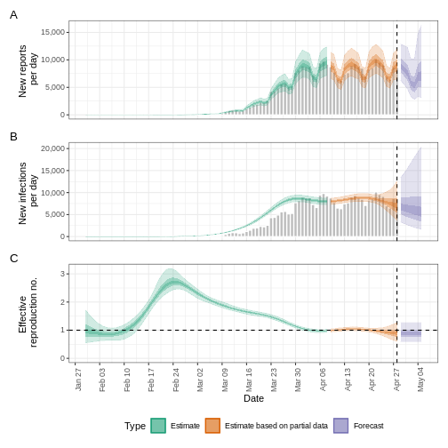
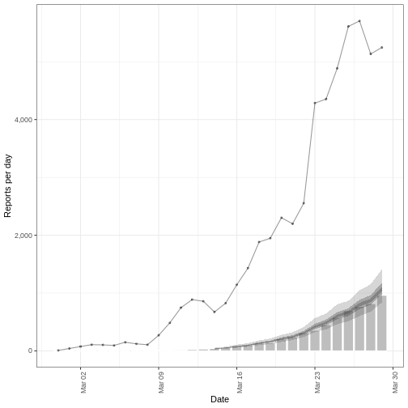
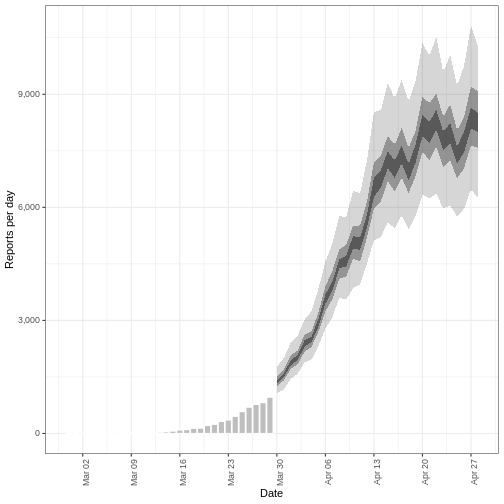

:::::::::::::::::::::::::::::::::::::: questions

- ¿Cómo puedo crear previsiones a corto plazo a partir de datos de casos?
- ¿Cómo tengo en cuenta los informes incompletos en las previsiones?

::::::::::::::::::::::::::::::::::::::::::::::::

::::::::::::::::::::::::::::::::::::: objectives

- Aprender a hacer previsiones de casos utilizando el paquete R `EpiNow2`
- Aprende a incluir un proceso de observación en la estimación

::::::::::::::::::::::::::::::::::::::::::::::::

::::::::::::::::::::::::::::::::::::: prereq

## Requisitos previos

- Tutorial completo [Cuantificar la transmisión](../episodes/quantify-transmissibility.md)

Los alumnos deben familiarizarse con las siguientes dependencias conceptuales antes de trabajar en este tutorial:

**Estadísticas** Distribuciones de probabilidad, principio del análisis bayesiano.

**Teoría epidémica** Número de reproducción efectiva.

:::::::::::::::::::::::::::::::::

## Introducción

Dados los datos de casos de una epidemia, podemos crear estimaciones del número actual y futuro de casos teniendo en cuenta tanto los retrasos
en la notificación y la infranotificación. Para hacer afirmaciones sobre el futuro de la epidemia, tenemos que hacer una suposición sobre cómo
las observaciones hasta el presente están relacionadas con lo que esperamos que ocurra en el futuro. La forma más sencilla de hacerlo es suponer que "no hay cambios", es decir, que el número de reproducciones sigue siendo el mismo en el futuro que el último observado. En este tutorial crearemos [previsiones](../learners/reference.md#forecast) suponiendo que el número de reproducción seguirá siendo el mismo que el estimado en la última fecha para la que se disponía de datos.

En este tutorial vamos a aprender a utilizar la función `{EpiNow2}` para prever los casos teniendo en cuenta las observaciones incompletas y prever las observaciones secundarias, como las defunciones.

Utilizaremos la tubería `%>%` para conectar funciones, así que vamos a llamar también a la función `{tidyverse}` paquete:

```r
library(EpiNow2)
library(tidyverse)
```


::::::::::::::::::: checklist

### El doble punto

El doble punto `::` en R te permite llamar a una función específica de un paquete sin cargar todo el paquete en el entorno actual.

Por ejemplo `dplyr::filter(data, condition)` utiliza `filter()` del `{dplyr}` paquete.

Esto nos ayuda a recordar las funciones del paquete y a evitar conflictos de espacio de nombres.

:::::::::::::::::::

## Crear una previsión a corto plazo

La función `epinow()` descrita en el [cuantificación de la transmisión](../episodes/quantify-transmissibility.md) es una envoltura de las funciones:

- `estimate_infections()` utilizadas para estimar los casos por fecha de infección.
- `forecast_infections()` Se utiliza para simular infecciones utilizando un ajuste existente (estimación) a los casos observados.

Utilicemos el mismo código utilizado en [cuantificar la transmisi](../episodes/quantify-transmissibility.md) para obtener los datos de entrada, los retardos y las priors:


``` r
# Read cases dataset
cases <- incidence2::covidregionaldataUK %>%
  # use {tidyr} to preprocess missing values
  tidyr::replace_na(base::list(cases_new = 0)) %>%
  # use {incidence2} to compute the daily incidence
  incidence2::incidence(
    date_index = "date",
    counts = "cases_new",
    count_values_to = "confirm",
    date_names_to = "date",
    complete_dates = TRUE
  ) %>%
  dplyr::select(-count_variable)

# Incubation period
incubation_period_fixed <- EpiNow2::Gamma(
  mean = 4,
  sd = 2,
  max = 20
)

# Log-tranformed mean
log_mean <- EpiNow2::convert_to_logmean(mean = 2, sd = 1)

# Log-transformed std
log_sd <- EpiNow2::convert_to_logsd(mean = 2, sd = 1)

# Reporting dalay
reporting_delay_fixed <- EpiNow2::LogNormal(
  mean = log_mean,
  sd = log_sd,
  max = 10
)

# Generation time
generation_time_fixed <- EpiNow2::LogNormal(
  mean = 3.6,
  sd = 3.1,
  max = 20
)

# define Rt prior distribution
rt_prior <- EpiNow2::rt_opts(prior = base::list(mean = 2, sd = 2))
```

Ahora podemos extraer la previsión a corto plazo utilizando:


``` r
# Assume we only have the first 90 days of this data
reported_cases <- cases %>%
  dplyr::slice(1:90)

# Estimate and forecast
estimates <- EpiNow2::epinow(
  data = reported_cases,
  generation_time = EpiNow2::generation_time_opts(generation_time_fixed),
  delays = EpiNow2::delay_opts(incubation_period_fixed + reporting_delay_fixed),
  rt = rt_prior
)
```

``` output
WARN [2024-07-05 21:22:38] epinow: There were 9 divergent transitions after warmup. See
https://mc-stan.org/misc/warnings.html#divergent-transitions-after-warmup
to find out why this is a problem and how to eliminate them. - 
WARN [2024-07-05 21:22:38] epinow: Examine the pairs() plot to diagnose sampling problems
 - 
```

::::::::::::::::::::::::::::::::: callout

### ¡No esperes a que se complete!

Esta última parte puede tardar 10 minutos en ejecutarse. Sigue leyendo este episodio del tutorial mientras esto se ejecuta en segundo plano. Para más información sobre el tiempo de computación, lee la sección "Inferencia Bayesiana con Stan" dentro del tutorial [cuantificar la transmisi](../episodes/quantify-transmissibility.md) de la transmisión.

:::::::::::::::::::::::::::::::::

Podemos visualizar las estimaciones del número de reproducciones efectivas y del número estimado de casos utilizando `plot()`. Las estimaciones se dividen en tres categorías:

- **Estimación** (verde): utiliza todos los datos,

- **Estimación basada en datos parciales** (naranja): contiene un mayor grado de incertidumbre porque dichas estimaciones se basan en menos datos,

- **Previsión** (morado): previsiones hacia el futuro.


``` r
plot(estimates)
```



### Previsión con observaciones incompletas

En la [cuantificación de la transmisión](../episodes/quantify-transmissibility.md) tuvimos en cuenta los retrasos en la notificación. `EpiNow2` también podemos tener en cuenta las observaciones incompletas, ya que, en realidad, el 100% de los casos no se notifican.
Pasaremos otro argumento a `epinow()` función llamada `obs` para definir un modelo de observación. El formato de `obs` se define mediante la función `obs_opt()` (véase `?EpiNow2::obs_opts` para más detalles).

Supongamos que creemos que los datos del brote COVID-19 del `cases` objeto no incluyen todos los casos notificados. Creemos que sólo observamos el 40% de los casos. Para especificar esto en el modelo de observación, debemos pasar un factor de escala con una media y una desviación típica. Si suponemos que el 40% de los casos están en los datos de casos (con una desviación típica del 1%), entonces especificamos el factor `scale` de entrada a `obs_opts()` como sigue:


``` r
obs_scale <- base::list(mean = 0.4, sd = 0.01)
```

Para ejecutar el marco de inferencia con este proceso de observación, añadimos `obs = obs_opts(scale = obs_scale)` a los argumentos de entrada de `epinow()`:


``` r
# Define observation model
obs_scale <- base::list(mean = 0.4, sd = 0.01)

# Assume we only have the first 90 days of this data
reported_cases <- cases %>%
  dplyr::slice(1:90)

# Estimate and forecast
estimates <- EpiNow2::epinow(
  data = reported_cases,
  generation_time = EpiNow2::generation_time_opts(generation_time_fixed),
  delays = EpiNow2::delay_opts(incubation_period_fixed + reporting_delay_fixed),
  rt = rt_prior,
  # Add observation model
  obs = EpiNow2::obs_opts(scale = obs_scale)
)
```

``` output
WARN [2024-07-05 21:38:54] epinow: There were 2 divergent transitions after warmup. See
https://mc-stan.org/misc/warnings.html#divergent-transitions-after-warmup
to find out why this is a problem and how to eliminate them. - 
WARN [2024-07-05 21:38:54] epinow: Examine the pairs() plot to diagnose sampling problems
 - 
```

``` r
base::summary(estimates)
```

``` output
                            measure                estimate
                             <char>                  <char>
1:           New infections per day   17173 (9141 -- 30826)
2: Expected change in daily reports       Likely decreasing
3:       Effective reproduction no.      0.88 (0.59 -- 1.2)
4:                   Rate of growth -0.043 (-0.18 -- 0.096)
5:     Doubling/halving time (days)       -16 (7.2 -- -3.8)
```

Las estimaciones de las medidas de transmisión, como el número de reproducción efectivo y la tasa de crecimiento, son similares (o tienen el mismo valor) que cuando no tuvimos en cuenta las observaciones incompletas (ver [cuantificar el episodio de trans](../episodes/quantify-transmissibility.md) en la sección "Encontrar estimaciones"). Sin embargo, el número de nuevos casos confirmados por fecha de infección ha cambiado sustancialmente de magnitud para reflejar la suposición de que sólo el 40% de los casos están en el conjunto de datos.

También podemos cambiar la distribución por defecto de Binomial Negativa a Poisson, eliminar el efecto de semana por defecto y más. Consulta `?EpiNow2::obs_opts` para más detalles.

::::::::::::::::::::::::::: debate

### ¿Cuáles son las implicaciones de este cambio?

- Comparar diferentes porcentajes de observaciones %
- ¿En qué se diferencian en el número de infecciones estimadas?
- ¿Qué implicaciones tiene este cambio para la salud pública?

:::::::::::::::::::::::::::

## Previsión de observaciones secundarias

`EpiNow2` también tiene la capacidad de estimar y pronosticar observaciones secundarias, por ejemplo, muertes y hospitalizaciones, a partir de una observación primaria, por ejemplo, casos. Aquí ilustraremos cómo prever el número de muertes derivadas de los casos observados de COVID-19 en las primeras fases del brote del Reino Unido.

En primer lugar, debemos formatear nuestros datos para que tengan las siguientes columnas:

- `date`: la fecha (como objeto de fecha ver `?is.Date()`),
- `primary`: número de observaciones primarias en esa fecha, en este ejemplo **casos**,
- `secondary`: número de observaciones secundarias fecha, en este ejemplo **defunciones**.


``` r
reported_cases_deaths <- incidence2::covidregionaldataUK %>%
  # use {tidyr} to preprocess missing values
  tidyr::replace_na(base::list(cases_new = 0, deaths_new = 0)) %>%
  # use {incidence2} to compute the daily incidence
  incidence2::incidence(
    date_index = "date",
    counts = c(primary = "cases_new", secondary = "deaths_new"),
    date_names_to = "date",
    complete_dates = TRUE
  ) %>%
  # rearrange to wide format for {EpiNow2}
  pivot_wider(names_from = count_variable, values_from = count)
```

<div class="figure" style="text-align: center">

<p class="caption">Distribution of secondary cases (deaths). We will drop the first 30 days with no observed deaths. We will use the deaths between day 31 and day 60 to estimate the secondary observations. We will forecast deaths from day 61 to day 90.</p>
</div>

Utilizando los datos sobre casos y muertes entre el día 31 y el día 60, estimaremos la relación entre las observaciones primarias y secundarias utilizando `estimate_secondary()` y, a continuación, pronosticaremos las muertes futuras mediante `forecast_secondary()`. Para más detalles sobre el modelo, consulta el [documentación del](https://epiforecasts.io/EpiNow2/dev/articles/estimate_secondary.html).

Debemos especificar el tipo de observación mediante `type` en `secondary_opts()`, las opciones incluyen:

- "incidencia": las observaciones secundarias surgen de las observaciones primarias previas, es decir, de las muertes que surgen de los casos registrados.
- "Prevalencia": las observaciones secundarias surgen de una combinación de observaciones primarias actuales y observaciones secundarias anteriores, es decir, el uso de camas hospitalarias que surge de los ingresos hospitalarios actuales y del uso de camas hospitalarias anteriores.

En este ejemplo especificamos `secondary_opts(type = "incidence")`. Consulta `?EpiNow2::secondary_opts` para más detalles.

La última entrada clave es la distribución del retraso entre las observaciones primaria y secundaria. Aquí se trata del retraso entre la notificación del caso y la muerte, suponemos que sigue una distribución gamma con una media de 14 días y una desviación típica de 5 días (Alternativamente, podemos utilizar `{epiparameter}` para [acceder a los retrasos epidemiológicos](https://epiverse-trace.github.io/tutorials-early/delays-reuse.html)). Utilizando `Gamma()` especificamos una distribución gamma fija.

Hay más entradas de función para `estimate_secondary()` que se pueden especificar, incluida la adición de un proceso de observación, véase `?EpiNow2::estimate_secondary` para más detalles sobre estas opciones.

Encontrar el ajuste del modelo entre casos y muertes:


``` r
# Estimate from day 31 to day 60 of this data
cases_to_estimate <- reported_cases_deaths %>%
  slice(31:60)

# Delay distribution between case report and deaths
delay_report_to_death <- EpiNow2::Gamma(
  mean = EpiNow2::Normal(mean = 14, sd = 0.5),
  sd = EpiNow2::Normal(mean = 5, sd = 0.5),
  max = 30
)

# Estimate secondary cases
estimate_cases_to_deaths <- EpiNow2::estimate_secondary(
  data = cases_to_estimate,
  secondary = EpiNow2::secondary_opts(type = "incidence"),
  delays = EpiNow2::delay_opts(delay_report_to_death)
)
```

::::::::::::::::::::::::::::::::::::: callout

### Ten cuidado con la escala de tiempo

En las primeras fases de un brote puede haber cambios sustanciales en las pruebas y la notificación. Si hay cambios en las pruebas de un mes a otro, habrá un sesgo en el ajuste del modelo. Por tanto, debes tener cuidado con la escala temporal de los datos utilizados en el ajuste y la previsión del modelo.

::::::::::::::::::::::::::::::::::::::::::::::::

Trazamos el ajuste del modelo (cintas sombreadas) con las observaciones secundarias (diagrama de barras) y las observaciones primarias (línea de puntos) de la siguiente manera:


``` r
plot(estimate_cases_to_deaths, primary = TRUE)
```



Para utilizar este ajuste del modelo para pronosticar las muertes, pasamos un marco de datos consistente en la observación primaria (casos) para las fechas no utilizadas en el ajuste del modelo.

*Nota : en este episodio estamos utilizando datos en los que conocemos las muertes y los casos, por lo que creamos un marco de datos extrayendo los casos. Pero, en la práctica, se trataría de otro conjunto de datos formado sólo por los casos.*


``` r
# Forecast from day 61 to day 90
cases_to_forecast <- reported_cases_deaths %>%
  dplyr::slice(61:90) %>%
  dplyr::mutate(value = primary)
```

Para pronosticar, utilizamos el ajuste del modelo `estimate_cases_to_deaths`:


``` r
# Forecast secondary cases
deaths_forecast <- EpiNow2::forecast_secondary(
  estimate = estimate_cases_to_deaths,
  primary = cases_to_forecast
)

plot(deaths_forecast)
```


:::::::::::::::: spoiler

### haz una trama de previsión


``` r
deaths_forecast %>%
  purrr::pluck("predictions") %>%
  ggplot(aes(x = date, y = secondary)) +
  geom_col(
    fill = "grey", col = "white",
    show.legend = FALSE, na.rm = TRUE
  ) +
  geom_ribbon(aes(ymin = lower_90, ymax = upper_90),
              alpha = 0.2, linewidth = 1) +
  geom_ribbon(aes(ymin = lower_50, ymax = upper_50),
              alpha = 0.4, linewidth = 1) +
  geom_ribbon(aes(ymin = lower_20, ymax = upper_20),
              alpha = 0.6, linewidth = 1) +
  theme_bw() +
  labs(y = "Reports per day", x = "Date") +
  scale_x_date(date_breaks = "week", date_labels = "%b %d") +
  scale_y_continuous(labels = scales::comma) +
  theme(axis.text.x = ggplot2::element_text(angle = 90))
```



::::::::::::::::

El gráfico muestra la previsión de observaciones secundarias (defunciones) en las fechas para las que hemos registrado casos.
También es posible prever las defunciones mediante la previsión de casos, para lo que debes especificar `primary` como `estimates` salida de `estimate_infections()`.

:::::::::::::::::::::::::: callout

### Intervalos creíbles

En todos `{EpiNow2}` figuras de resultados, las regiones sombreadas reflejan los intervalos de credibilidad del 90%, 50% y 20% en orden de más claro a más oscuro.

::::::::::::::::::::::::::

## Reto: Análisis del brote de ébola

::::::::::::::::::::::::::::::::::::: challenge

Descarga el archivo [casos\_ébola.csv](data/ebola_cases.csv) y léelo en R. Los datos simulados consisten en la fecha de aparición de los síntomas y el número de casos confirmados de las primeras fases del brote de ébola en Sierra Leona en 2014.

Utiliza los 3 primeros meses (120 días) de datos:

1. Estima si los casos aumentan o disminuyen en el día 120 del brote
2. Contar con una capacidad de observación del 80% de los casos.
3. Crea una previsión de dos semanas del número de casos.

Puedes utilizar los siguientes valores de parámetro para la distribución o distribuciones del retraso y la distribución del tiempo de generación.

- Periodo de incubación: Log normal$(2.487,0.330)$ ([Eichner et al. 2011](https://doi.org/10.1016/j.phrp.2011.04.001) a través de `{epiparameter}`)
- Tiempo de generación: Gamma$(15.3, 10.1)$ ([Equipo de respuesta al ébola de la OMS 2014](https://www.nejm.org/doi/full/10.1056/NEJMoa1411100))

Puedes incluir cierta incertidumbre en torno a la media y la desviación típica de estas distribuciones.

::::::::::::::::: pista

Utilizamos el número de reproducción efectivo y la tasa de crecimiento para estimar si los casos aumentan o disminuyen.

Podemos utilizar el `horizon` argumento dentro del `epinow()` para ampliar el periodo de tiempo de la previsión. El valor por defecto es de siete días.

Asegúrate de que los datos tienen el formato correcto :

- `date`: la fecha (como objeto de fecha ver `?is.Date()`),
- `confirm` número de casos confirmados en esa fecha.

::::::::::::::::::::::

::::::::::::::::: solución

### SOLUCIÓN

Para estimar el número efectivo de reproducción y la tasa de crecimiento, utilizaremos la función `epinow()`.

Como los datos consisten en la fecha de aparición de los síntomas, sólo necesitamos especificar una distribución de retardo para el periodo de incubación y el tiempo de generación.

Especificamos las distribuciones con cierta incertidumbre en torno a la media y la desviación típica de la distribución log normal para el periodo de incubación y la distribución Gamma para el tiempo de generación.


``` r
epiparameter::epidist_db(disease = "ebola", epi_dist = "incubation") %>%
  epiparameter::parameter_tbl()
```

``` output
# Parameter table:
# A data frame:    5 × 7
  disease   pathogen epi_distribution prob_distribution author  year sample_size
  <chr>     <chr>    <chr>            <chr>             <chr>  <dbl>       <dbl>
1 Ebola Vi… Ebola V… incubation peri… lnorm             Eichn…  2011         196
2 Ebola Vi… Ebola V… incubation peri… gamma             WHO E…  2015        1798
3 Ebola Vi… Ebola V… incubation peri… gamma             WHO E…  2015          49
4 Ebola Vi… Ebola V… incubation peri… gamma             WHO E…  2015         957
5 Ebola Vi… Ebola V… incubation peri… gamma             WHO E…  2015         792
```

``` r
ebola_eichner <- epiparameter::epidist_db(
  disease = "ebola",
  epi_dist = "incubation",
  author = "Eichner"
)

ebola_eichner_parameters <- epiparameter::get_parameters(ebola_eichner)

ebola_incubation_period <- EpiNow2::LogNormal(
  meanlog = EpiNow2::Normal(
    mean = ebola_eichner_parameters["meanlog"],
    sd = 0.5
  ),
  sdlog = EpiNow2::Normal(
    mean = ebola_eichner_parameters["sdlog"],
    sd = 0.5
  ),
  max = 20
)

ebola_generation_time <- EpiNow2::Gamma(
  mean = EpiNow2::Normal(mean = 15.3, sd = 0.5),
  sd = EpiNow2::Normal(mean = 10.1, sd = 0.5),
  max = 30
)
```

Leemos los datos de entrada utilizando `readr::read_csv()`. Esta función reconoce que la columna `date` es una `<date>` vector de clase.


``` r
# read data
# e.g.: if path to file is data/raw-data/ebola_cases.csv then:
ebola_cases_raw <- readr::read_csv(
  here::here("data", "raw-data", "ebola_cases.csv")
)
```

Preprocesa y adapta los datos brutos para `{EpiNow2}`:


``` r
ebola_cases <- ebola_cases_raw %>%
  # use {tidyr} to preprocess missing values
  tidyr::replace_na(base::list(confirm = 0)) %>%
  # use {incidence2} to compute the daily incidence
  incidence2::incidence(
    date_index = "date",
    counts = "confirm",
    count_values_to = "confirm",
    date_names_to = "date",
    complete_dates = TRUE
  ) %>%
  dplyr::select(-count_variable)

dplyr::as_tibble(ebola_cases)
```

``` output
# A tibble: 123 × 2
   date       confirm
   <date>       <dbl>
 1 2014-05-18       1
 2 2014-05-19       0
 3 2014-05-20       2
 4 2014-05-21       4
 5 2014-05-22       6
 6 2014-05-23       1
 7 2014-05-24       2
 8 2014-05-25       0
 9 2014-05-26      10
10 2014-05-27       8
# ℹ 113 more rows
```

Definimos un modelo de observación para escalar el número estimado y previsto de nuevas infecciones:


``` r
# Define observation model
# mean of 80% and standard deviation of 1%
ebola_obs_scale <- base::list(mean = 0.8, sd = 0.01)
```

Como queremos crear también una previsión a dos semanas, especificamos `horizon = 14` para prever 14 días en lugar de los 7 días por defecto.


``` r
ebola_estimates <- EpiNow2::epinow(
  data = ebola_cases %>% dplyr::slice(1:120), # first 3 months of data only
  generation_time = EpiNow2::generation_time_opts(ebola_generation_time),
  delays = EpiNow2::delay_opts(ebola_incubation_period),
  # Add observation model
  obs = EpiNow2::obs_opts(scale = ebola_obs_scale),
  # horizon needs to be 14 days to create two week forecast (default is 7 days)
  horizon = 14
)
```

``` output
WARN [2024-07-05 21:42:40] epinow: There were 6 divergent transitions after warmup. See
https://mc-stan.org/misc/warnings.html#divergent-transitions-after-warmup
to find out why this is a problem and how to eliminate them. - 
WARN [2024-07-05 21:42:40] epinow: Examine the pairs() plot to diagnose sampling problems
 - 
```

``` r
summary(ebola_estimates)
```

``` output
                            measure              estimate
                             <char>                <char>
1:           New infections per day        84 (35 -- 202)
2: Expected change in daily reports     Likely increasing
3:       Effective reproduction no.     1.5 (0.82 -- 2.6)
4:                   Rate of growth 0.034 (-0.032 -- 0.1)
5:     Doubling/halving time (days)       21 (6.8 -- -22)
```

El número de reproducción efectivo $R_t$ estimado (en la última fecha de los datos) es 1.5 (0.82 -- 2.6). La tasa de crecimiento exponencial del número de casos es 0.034 (-0.032 -- 0.1).

Visualiza las estimaciones:


``` r
plot(ebola_estimates)
```

:::::::::::::::::::::::::::

::::::::::::::::::::::::::::::::::::::::::::::::

::::::::::::::::::::::::::::::::::::: callout

### Previsión con estimaciones de $R_t$

Por defecto, las previsiones a corto plazo se crean utilizando la última estimación del número de reproducción $R_t$. Como esta estimación se basa en datos parciales, tiene una incertidumbre considerable.

El número de reproducciones que se proyecta en el futuro puede cambiarse por una estimación menos reciente basada en más datos utilizando `rt_opts()`:


``` r
EpiNow2::rt_opts(future = "estimate")
```

El resultado serán previsiones menos inciertas (ya que se basan en $R_t$ con un intervalo de incertidumbre más estrecho), pero las previsiones se basarán en estimaciones menos recientes de $R_t$ y supondrán que no ha habido cambios desde entonces.

Además, existe la opción de [proyectar](../learners/reference.md#projection) el valor de $R_t$ en el futuro utilizando un modelo genérico fijando `future = "project"`. Como esta opción utiliza un modelo para prever el valor de $R_t$ el resultado serán previsiones más inciertas que `estimate` por ejemplo [ver aquí](https://epiforecasts.io/EpiNow2/dev/articles/estimate_infections_options.html#projecting-the-reproduction-number-with-the-gaussian-process).

::::::::::::::::::::::::::::::::::::::::::::::::

## Resumen

`EpiNow2` puede utilizarse para crear previsiones a corto plazo y estimar la relación entre distintos resultados. Hay una serie de opciones de modelo que pueden implementarse para diferentes análisis, incluida la adición de un proceso de observación para tener en cuenta los informes incompletos. Consulta la [viñeta](https://epiforecasts.io/EpiNow2/dev/articles/estimate_infections_options.html) para más detalles sobre las distintas opciones de modelo en `EpiNow2` que no se tratan en estos tutoriales.

::::::::::::::::::::::::::::::::::::: keypoints

- Podemos crear previsiones a corto plazo haciendo suposiciones sobre el comportamiento futuro del número de reproducción
- La notificación incompleta de casos puede tenerse en cuenta en las estimaciones

::::::::::::::::::::::::::::::::::::::::::::::::


