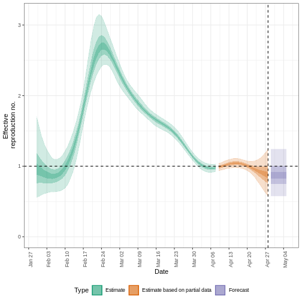
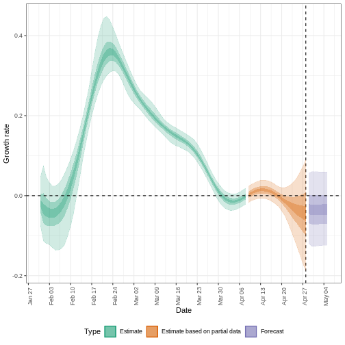
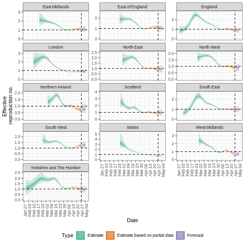

:::::::::::::::::::::::::::::::::::::: questions

- ¿Cómo puedo estimar el número de reproducción variable en el tiempo ($Rt$) y la tasa de crecimiento a partir de una serie temporal de datos de casos?
- ¿Cómo puedo cuantificar la heterogeneidad geográfica a partir de estas métricas de transmisión?

::::::::::::::::::::::::::::::::::::::::::::::::

::::::::::::::::::::::::::::::::::::: objectives

- Aprender a estimar las métricas de transmisión a partir de una serie temporal de datos de casos utilizando el paquete R `EpiNow2`

::::::::::::::::::::::::::::::::::::::::::::::::

::::::::::::::::::::::::::::::::::::: prereq

## Requisitos previos

Los alumnos deben familiarizarse con los siguientes conceptos antes de trabajar con este tutorial:

**Estadística** Distribuciones de probabilidad y principio del análisis bayesiano.

**Teoría epidémica** Número de reproducción efectiva.

**Ciencia de los datos** Transformación y visualización de datos. Puedes revisar el episodio en [Agregar y visualizar](https://epiverse-trace.github.io/tutorials-early/describe-cases.html) datos de incidencia.

:::::::::::::::::::::::::::::::::

::::::::::::::::::::::::::::::::::::: callout

### Recordatorio: el Número de Reproducción Efectiva, $R_t$

El [número básico de reproducción](../learners/reference.md#basic), $R_0$ es el número medio de casos causados por un individuo infeccioso en una población totalmente susceptible.

Pero en un brote en curso, la población no permanece totalmente susceptible, ya que los que se recuperan de la infección suelen ser inmunes. Además, puede haber cambios de comportamiento u otros factores que afecten la transmisión. Por lo tanto, cuando nos interesa controlar los cambios en la transmisión, es más importante tener en cuenta el valor del **número de reproducción efectiva**, $R_t$ y el número medio de casos causados por un individuo infeccioso en la población en el momento $t$.

::::::::::::::::::::::::::::::::::::::::::::::::

## Introducción

La intensidad de la transmisión de un brote se cuantifica mediante dos métricas clave: el número de reproducción, que informa sobre la fuerza de la transmisión indicando cuántos casos nuevos se esperan de cada caso existente; y la [tasa de crecimiento](../learners/reference.md#growth) que informa sobre la velocidad de la transmisión, indicando la rapidez con que el brote se propaga o disminuye (tiempo de duplicación/desaparición) dentro de una población. Para más detalles sobre la distinción entre velocidad y fuerza de transmisión y las implicaciones para el control, revisa [Dushoff y Park, 2021](https://royalsocietypublishing.org/doi/full/10.1098/rspb.2020.1556).

Para estimar estas métricas clave utilizando datos de casos, debemos tener en cuenta los retrasos entre la fecha de las infecciones y la fecha de los casos notificados. En una situación de brote, normalmente sólo se dispone de datos sobre las fechas notificadas, por lo que debemos utilizar métodos de estimación para tener en cuenta estos retrasos cuando intentemos comprender los cambios en la transmisión a lo largo del tiempo.

En los próximos tutoriales nos centraremos en cómo utilizar las funciones de `{EpiNow2}` para estimar las métricas de transmisión de los datos de casos. No cubriremos el trasfondo teórico de los modelos ni el marco de inferencia; para más detalles sobre estos conceptos, consulta la [viñeta](https://epiforecasts.io/EpiNow2/dev/articles/estimate_infections.html).

En este tutorial vamos a aprender a utilizar el paquete `{EpiNow2}` para estimar el número de reproducción variable en el tiempo. Obtendremos los datos de entrada de `{incidence2}`. Utilizaremos el paquete `{tidyr}` y `{dplyr}` para ordenar algunas de sus salidas, `{ggplot2}` para visualizar la distribución de casos, y el operador tubería `%>%` para conectar algunas de sus funciones, así que también llamaremos al paquete `{tidyverse}`:

```r
library(EpiNow2)
library(incidence2)
library(tidyverse)
```


::::::::::::::::::: checklist

### El doble punto

El doble punto `::` en R te permite llamar a una función específica de un paquete sin cargar todo el paquete en el entorno actual.

Por ejemplo `dplyr::filter(data, condition)` utiliza la función `filter()` del paquete `{dplyr}`.

Esto nos ayuda a recordar las funciones del paquete y a evitar conflictos de espacio de nombres.

:::::::::::::::::::

:::::::::::::::::::::::::::::::::::::::::::::::::::::::::::::::::::: instructor

Este tutorial muestra el uso de la función `epinow()` para estimar el número de reproducción variable en el tiempo y los tiempos de infección, las entradas necesarias para el modelo y las limitaciones de su resultado.

::::::::::::::::::::::::::::::::::::::::::::::::::::::::::::::::::::::::::::::::

::::::::::::::::::::::::::::::::::::: callout

### Inferencia bayesiana

El paquete R `EpiNow2` utiliza [inferencia bayesiana](../learners/reference.md#bayesian) para estimar las cifras de reproducción y los tiempos de infección basándose en las fechas de notificación.

En la inferencia bayesiana, utilizamos el conocimiento previo (distribuciones previas) con los datos (en una función de verosimilitud) para hallar la probabilidad posterior.

<p class="text-center" style="background-color: white">Probabilidad posterior $\propto$ verosimilitud $\times$ probabilidad previa
</p>

::::::::::::::::::::::::::::::::::::::::::::::::

:::::::::::::::::::::::::::::::::::::::::::::::: instructor

Consulta la distribución de probabilidad a priori y la [probabilidad posterior](https://en.wikipedia.org/wiki/Posterior_probability).

En la ["`Expected change in daily cases`"](#expected-change-in-daily-cases) por "la probabilidad posterior de que $R_t < 1$", nos referimos específicamente a la [área bajo la curva de distribución de probabilidad po](https://www.nature.com/articles/nmeth.3368/figures/1).

::::::::::::::::::::::::::::::::::::::::::::::::

## Distribuciones de retrasos y datos de casos

### Datos de casos

Para explorar las funciones de `EpiNow2` utilizaremos los datos del brote del inicio de la pandemia COVID-19 del Reino Unido. Los datos están disponibles en el paquete R `{incidence2}`.


``` r
dplyr::as_tibble(incidence2::covidregionaldataUK)
```

``` output
# A tibble: 6,370 × 13
   date       region   region_code cases_new cases_total deaths_new deaths_total
   <date>     <chr>    <chr>           <dbl>       <dbl>      <dbl>        <dbl>
 1 2020-01-30 East Mi… E12000004          NA          NA         NA           NA
 2 2020-01-30 East of… E12000006          NA          NA         NA           NA
 3 2020-01-30 England  E92000001           2           2         NA           NA
 4 2020-01-30 London   E12000007          NA          NA         NA           NA
 5 2020-01-30 North E… E12000001          NA          NA         NA           NA
 6 2020-01-30 North W… E12000002          NA          NA         NA           NA
 7 2020-01-30 Norther… N92000002          NA          NA         NA           NA
 8 2020-01-30 Scotland S92000003          NA          NA         NA           NA
 9 2020-01-30 South E… E12000008          NA          NA         NA           NA
10 2020-01-30 South W… E12000009          NA          NA         NA           NA
# ℹ 6,360 more rows
# ℹ 6 more variables: recovered_new <dbl>, recovered_total <dbl>,
#   hosp_new <dbl>, hosp_total <dbl>, tested_new <dbl>, tested_total <dbl>
```

Para utilizar los datos, debemos darles formato para que tengan dos columnas:

- `date`: la fecha (para validar si un objeto es de tipo fecha ver `?is.Date()`),
- `confirm` número de casos confirmados en esa fecha.

Utilicemos `{tidyr}` y `{incidence2}` para ello:


``` r
cases <- incidence2::covidregionaldataUK %>%
  # use {tidyr} to preprocess missing values
  tidyr::replace_na(base::list(cases_new = 0)) %>%
  # use {incidence2} to compute the daily incidence
  incidence2::incidence(
    date_index = "date",
    counts = "cases_new",
    count_values_to = "confirm",
    date_names_to = "date",
    complete_dates = TRUE
  ) %>%
  dplyr::select(-count_variable)
```

Con `incidence2::incidence()` agregamos casos en distintos tiempos *intervalos* (es decir, días, semanas o meses) o por *grupo* categorías. También podemos tener fechas completas para todo el rango de fechas por categoría de grupo utilizando `complete_dates = TRUE`
Explora más adelante la [`incidence2::incidence()` manual de referencia](https://www.reconverse.org/incidence2/reference/incidence.html)

::::::::::::::::::::::::: spoiler

### ¿Podemos replicar {incidence2} con {dplyr}?

Podemos obtener un objeto similar a `cases` de la tabla de datos (`data.frame`) `incidence2::covidregionaldataUK` utilizando las siguientes funciones del paquete `{dplyr}`:


``` r
incidence2::covidregionaldataUK %>%
  dplyr::select(date, cases_new) %>%
  dplyr::group_by(date) %>%
  dplyr::summarise(confirm = sum(cases_new, na.rm = TRUE)) %>%
  dplyr::ungroup()
```

Sin embargo, la función `incidence2::incidence()` contiene argumentos prácticos como `complete_dates` que facilitan la obtención de un objeto de incidencia con el mismo rango de fechas para cada agrupación sin necesidad de líneas de código adicionales ni de un paquete de series temporales.

:::::::::::::::::::::::::

Hay datos de casos disponibles para 490 días, pero en una situación de brote es probable que sólo tuviéramos acceso al principio de este conjunto de datos. Por lo tanto, suponemos que sólo disponemos de los primeros 90 días de estos datos.


### Distribuciones de retraso

Suponemos que hay retrasos desde el momento de la infección hasta el momento en que se notifica un caso. Especificamos estos retrasos como distribuciones para tener en cuenta la incertidumbre en las diferencias a nivel individual. El retraso puede consistir en múltiples tipos de retrasos/procesos. Un retraso típico desde el momento de la infección hasta la notificación del caso puede consistir en:

**tiempo desde la infección hasta la aparición de los síntomas** (el [período de incubación](../learners/reference.md#incubation)) + **tiempo desde el inicio de los síntomas hasta la notificación del caso** (el tiempo de notificación).

La distribución del retraso para cada uno de estos procesos puede estimarse a partir de los datos u obtenerse de la bibliografía. Podemos expresar la incertidumbre sobre cuáles son los parámetros correctos de las distribuciones, suponiendo que las distribuciones tienen parámetros **fijos** (`_fixed`) o si tienen parámetros **variables** (`_variable`). Para entender la diferencia entre distribuciones **fijas** y **variables**, consideremos el periodo de incubación.

::::::::::::::::::::::::::::::::::::: callout

### Retrasos y datos

El número de retrasos y su tipo son una entrada flexible que depende de los datos. Los siguientes ejemplos muestran cómo se pueden especificar los retrasos para distintas fuentes de datos:

<center>

| Fuente de datos                | Retraso(s)                                                                                    | 
| ------------------------------ | --------------------------------------------------------------------------------------------- |
| Hora de inicio de los síntomas | Periodo de incubación                                                                         | 
| Hora del informe del caso      | Periodo de incubación + tiempo desde el inicio de los síntomas hasta la notificación del caso | 
| Tiempo de hospitalización      | Periodo de incubación + tiempo desde el inicio de los síntomas hasta la hospitalización       | 

</center>

::::::::::::::::::::::::::::::::::::::::::::::::

#### Distribución del periodo de incubación

La distribución del periodo de incubación de muchas enfermedades suele obtenerse de la bibliografía. El paquete `{epiparameter}` contiene una biblioteca de parámetros epidemiológicos de distintas enfermedades obtenidos de la literatura.

Especificamos una distribución gamma (fija) con media $\mu = 4$ y desviación típica $\sigma= 2$ (forma = $4$, escala = $1$) mediante la función `Gamma()` de la siguiente manera:


``` r
incubation_period_fixed <- EpiNow2::Gamma(
  mean = 4,
  sd = 2,
  max = 20
)

incubation_period_fixed
```

``` output
- gamma distribution (max: 20):
  shape:
    4
  rate:
    1
```

El argumento `max` es el valor máximo que puede tomar la distribución, en este ejemplo 20 días.

::::::::::::::::::::::::::::::::::::: callout

### ¿Por qué una distribución gamma?

El periodo de incubación debe tener un valor positivo. Por lo tanto, tenemos que especificar una distribución en `{EpiNow2}` que sea sólo para valores positivos.

`Gamma()` admite distribuciones Gamma y `LogNormal()` Distribuciones logarítmicas normales, que son distribuciones sólo para valores positivos.

Para todos los tipos de retraso, tendremos que utilizar distribuciones sólo para valores positivos: ¡no queremos incluir retrasos de días negativos en nuestro análisis!

::::::::::::::::::::::::::::::::::::::::::::::::

#### Incluyendo la incertidumbre de distribución

Para especificar una distribución **variable**, incluimos la incertidumbre en torno a la media $\mu$ y la desviación típica $\sigma$ de nuestra distribución gamma. Si nuestra distribución del periodo de incubación tiene una media $\mu$ y una desviación típica $\sigma$ entonces suponemos que la media ($\mu$) sigue una distribución Normal con desviación típica $\sigma_{\mu}$:

$$\mbox{Normal}(\mu,\sigma_{\mu}^2)$$

y una desviación típica ($\sigma$) sigue una distribución Normal con desviación típica $\sigma_{\sigma}$:

$$\mbox{Normal}(\sigma,\sigma_{\sigma}^2).$$

Lo especificamos utilizando `Normal()` para cada argumento: la media ($\mu=4$ con $\sigma_{\mu}=0.5$) y la desviación típica ($\sigma=2$ con $\sigma_{\sigma}=0.5$).


``` r
incubation_period_variable <- EpiNow2::Gamma(
  mean = EpiNow2::Normal(mean = 4, sd = 0.5),
  sd = EpiNow2::Normal(mean = 2, sd = 0.5),
  max = 20
)

incubation_period_variable
```

``` output
- gamma distribution (max: 20):
  shape:
    - normal distribution:
      mean:
        4
      sd:
        0.61
  rate:
    - normal distribution:
      mean:
        1
      sd:
        0.31
```

#### Retrasos en los informes

Tras el periodo de incubación, habrá un retraso adicional desde el inicio de los síntomas hasta la notificación del caso: el retraso de notificación. Podemos especificarlo como una distribución fija o variable, o estimar una distribución a partir de los datos.

Al especificar una distribución, es útil visualizar la densidad de probabilidad para ver el pico y la dispersión de la distribución, en este caso utilizaremos una *log normal* logarítmica normal. Podemos utilizar las funciones `convert_to_logmean()` y `convert_to_logsd()` para convertir la media y la desviación típica de una distribución normal en las de una distribución logarítmica normal.

Si queremos suponer que la media del retraso en la notificación es de 2 días (con una desviación típica de 1 día), escribimos:


``` r
# obtener logmean a partir de la media y sd
log_mean <- EpiNow2::convert_to_logmean(mean = 2, sd = 1)

# obtener logsd a partir de la media y sd
log_sd <- EpiNow2::convert_to_logsd(mean = 2, sd = 1)
```

:::::::::::::::::::::: spoiler

### Visualiza una distribución log Normal utilizando {epiparameter}

Utilizando `epiparameter::epidist()` podemos crear una distribución personalizada. La distribución log normal tendrá el siguiente aspecto:

```r
library(epiparameter)
```


``` r
epiparameter::epidist(
  disease = "covid",
  epi_dist = "reporting delay", # retraso del reporte
  prob_distribution = "lnorm",
  prob_distribution_params = c(
    meanlog = log_mean,
    sdlog = log_sd
  )
) %>%
  plot()
```


::::::::::::::::::::::

Utilizando la media y la desviación típica de la distribución log normal, podemos especificar una distribución fija o variable utilizando `LogNormal()` como antes:


``` r
reporting_delay_variable <- EpiNow2::LogNormal(
  meanlog = EpiNow2::Normal(mean = log_mean, sd = 0.5),
  sdlog = EpiNow2::Normal(mean = log_sd, sd = 0.5),
  max = 10
)
```

Podemos trazar distribuciones simples y combinadas generadas por `{EpiNow2}` utilizando `plot()`. Combinemos en un gráfico el retraso desde la infección hasta la notificación, que incluye el periodo de incubación y el retraso en la notificación:


``` r
plot(incubation_period_variable + reporting_delay_variable)
```


:::::::::::::::::: callout

Si disponemos de datos sobre el tiempo transcurrido entre el inicio de los síntomas y la notificación, podemos utilizar la función `estimate_delay()` para estimar una distribución log normal a partir de un vector de retrasos. El siguiente código muestra cómo utilizar `estimate_delay()` con datos sintéticos de retrasos.


``` r
delay_data <- rlnorm(500, log(5), 1) # datos de retraso sintéticos

reporting_delay <- EpiNow2::estimate_delay(
  delay_data,
  samples = 1000,
  bootstraps = 10
)
```

::::::::::::::::::

#### Tiempo de generación

También debemos especificar una distribución para el tiempo de generación. Aquí utilizaremos una distribución log normal con media 3.6 y desviación típica 3.1 ([Ganyani et al. 2020](https://doi.org/10.2807/1560-7917.ES.2020.25.17.2000257)).


``` r
generation_time_variable <- EpiNow2::LogNormal(
  mean = EpiNow2::Normal(mean = 3.6, sd = 0.5),
  sd = EpiNow2::Normal(mean = 3.1, sd = 0.5),
  max = 20
)
```

## Estimaciones de hallazgos

La función `epinow()` es una envoltura de la función `estimate_infections()` utilizada para estimar los casos por fecha de infección. La distribución del tiempo de generación y las distribuciones del retraso deben pasarse utilizando las funciones ` generation_time_opts()` y `delay_opts()` respectivamente.

Hay muchas otras entradas que se pueden pasar a `epinow()` ver `?EpiNow2::epinow()` para más detalles.
Una entrada opcional es especificar una *log normal* para el número de reproducción efectivo $R_t$ al inicio del brote. Especificamos una media de 2 días y una desviación típica de 2 días como argumentos de `prior` dentro de `rt_opts()`:


``` r
# define Rt prior distribution
rt_prior <- EpiNow2::rt_opts(prior = base::list(mean = 2, sd = 2))
```

::::::::::::::::::::::::::::::::::::: callout

### Inferencia bayesiana con Stan

La inferencia bayesiana se realiza utilizando métodos MCMC con el programa [Stan](https://mc-stan.org/). Hay una serie de entradas por defecto para las funciones Stan, incluido el número de cadenas y el número de muestras por cadena (ver `?EpiNow2::stan_opts()`).

Para reducir el tiempo de cálculo, podemos ejecutar las cadenas en paralelo. Para ello, debemos establecer el número de núcleos que se van a utilizar. Por defecto, se ejecutan 4 cadenas MCMC (ver `stan_opts()$chains`), por lo que podemos establecer un número igual de núcleos para que se utilicen en paralelo de la siguiente manera:


``` r
withr::local_options(base::list(mc.cores = 4))
```

Para averiguar el número máximo de núcleos disponibles en tu máquina, utiliza `parallel::detectCores()`.

::::::::::::::::::::::::::::::::::::::::::::::::

::::::::::::::::::::::::: checklist

**Nota:** En el siguiente código `_fixed` se utilizan distribuciones en lugar de `_variable` (distribuciones de retraso con incertidumbre). Esto se hace para acelerar el tiempo de cálculo. En general, se recomienda utilizar distribuciones variables que tengan en cuenta la incertidumbre adicional.


``` r
# alternativas: distribuciones con parámetros fijos
generation_time_fixed <- EpiNow2::LogNormal(
  mean = 3.6,
  sd = 3.1,
  max = 20
)

reporting_delay_fixed <- EpiNow2::LogNormal(
  mean = log_mean,
  sd = log_sd,
  max = 10
)
```

:::::::::::::::::::::::::

Ahora estás listo para ejecutar `EpiNow2::epinow()` para estimar el número de reproducción variable en el tiempo durante los primeros 90 días:


``` r
reported_cases <- cases %>%
  dplyr::slice_head(n = 90)
```


``` r
estimates <- EpiNow2::epinow(
  # casos
  data = reported_cases,
  # retrasos
  generation_time = EpiNow2::generation_time_opts(generation_time_fixed),
  delays = EpiNow2::delay_opts(incubation_period_fixed + reporting_delay_fixed),
  # prior
  rt = rt_prior
)
```

``` output
WARN [2024-07-16 00:45:30] epinow: There were 2 divergent transitions after warmup. See
https://mc-stan.org/misc/warnings.html#divergent-transitions-after-warmup
to find out why this is a problem and how to eliminate them. - 
WARN [2024-07-16 00:45:30] epinow: Examine the pairs() plot to diagnose sampling problems
 - 
```

<!-- ```{r, mensaje = FALSE,advertencia=FALSE, eval = TRUE, echo=FALSE} -->

<!-- estimaciones <- EpiNow2::epinow( -->

<!-- # casos -->

<!-- datos = casos_informados, -->

<!-- # retrasos -->

<!-- tiempo_de_generación = EpiNow2::tiempo_de_generación_opts(tiempo_de_generación_fijo), -->

<!-- retrasos = EpiNow2::retraso_opts(periodo_de_incubación_fijo + retraso_de_informe_fijo), -->

<!-- # anterior -->

<!-- rt = rt_previo, -->

<!-- stan = EpiNow2::stan_opts(method = "vb") -->

<!-- ) -->

<!-- ``` -->

::::::::::::::::::::::::::::::::: callout

### No esperes a que esto continúe

Para efectos de este tutorial, podemos utilizar opcionalmente `EpiNow2::stan_opts()` para reducir el tiempo de cálculo. Podemos especificar un número fijo de `samples = 1000` y `chains = 3` al argumento `stan` de la función `EpiNow2::epinow()`. Esperamos que esto lleve aproximadamente 3 minutos.

<!-- Podemos establecer opcionalmente `stan = stan_opts(method = "vb")` para utilizar un método de muestreo aproximado. Esperamos que tarde menos de 1 minuto. -->

```r
# puedes adicionar el argumento `stan`
EpiNow2::epinow(
  ...,
  stan = EpiNow2::stan_opts(samples = 1000, chains = 3)
)
```

**Recuerda:** Utilizar un número adecuado de *muestras* y *cadenas* es crucial para garantizar la convergencia y obtener estimaciones fiables en los cálculos bayesianos con Stan. Los resultados más precisos se obtienen a costa de la velocidad.

:::::::::::::::::::::::::::::::::

### Resultados

Podemos extraer y visualizar estimaciones del número de reproducción efectivo a lo largo del tiempo:


``` r
estimates$plots$R
```



La incertidumbre de las estimaciones aumenta con el tiempo. Esto se debe a que las estimaciones se basan en datos del pasado, dentro de los periodos de retraso. Esta diferencia de incertidumbre se clasifica en **Estimación** (verde) utiliza todos los datos y **Estimación basada en datos parciales** (naranja) estimaciones que se basan en menos datos (porque es más probable que las infecciones que se produjeron en su momento no se hayan observado todavía), por este motivo, tienen intervalos cada vez más amplios hacia la fecha del último punto de datos. Por último, el **Pronóstico** (morado) es una proyección a futuro.

También podemos visualizar la estimación de la tasa de crecimiento a lo largo del tiempo:


``` r
estimates$plots$growth_rate
```



Para extraer un resumen de las métricas clave de transmisión en la *última fecha* de los datos:


``` r
summary(estimates)
```

``` output
                            measure               estimate
                             <char>                 <char>
1:           New infections per day   6810 (3528 -- 12088)
2: Expected change in daily reports      Likely decreasing
3:       Effective reproduction no.     0.87 (0.57 -- 1.2)
4:                   Rate of growth -0.047 (-0.2 -- 0.093)
5:     Doubling/halving time (days)      -15 (7.5 -- -3.5)
```

Como estas estimaciones se basan en datos parciales, tienen un amplio intervalo de incertidumbre.

- Del resumen de nuestro análisis se desprende que el cambio esperado en los casos diarios es de  con la estimación de nuevos casos confirmados .

- El número de reproducción efectivo $R_t$ estimado (en la última fecha de los datos) es 0.87 (0.57 -- 1.2).

- La tasa de crecimiento exponencial del número de casos es -0.047 (-0.2 -- 0.093).

- El tiempo de duplicación (el tiempo que tarda en duplicarse el número de casos) es -15 (7.5 -- -3.5).

::::::::::::::::::::::::::::::::::::: callout

### `Expected change in daily cases`

Un factor que describe el cambio esperado en los casos diarios, basado en la probabilidad posterior de que $R_t < 1$.

<center>
| Probabilidad ($p$) | Cambio esperado |
| ------------- |-------------|
|$p < 0,05$ |Aumentando |$ 0,05
|$0,05 \leq p< 0,4$ |Probable aumento |
|0,4 p< 0,6$ Estable
|0,6 p < 0,95$ Probable disminución
|0,95 \leq p \leq 1$ |En disminución |Estable
</center>

::::::::::::::::::::::::::::::::::::::::::::::::

## Cuantificar la heterogeneidad geográfica

Los datos del brote del inicio de la pandemia COVID-19 del Reino Unido del paquete R `{incidence2}` incluyen la región en la que se registraron los casos. Para encontrar estimaciones regionales del número de reproducción efectiva y de casos, debemos dar formato a los datos para que tengan tres columnas:

- `date`: la fecha.
- `region`: la región.
- `confirm`: número de casos confirmados para una región en una fecha determinada.


``` r
regional_cases <- incidence2::covidregionaldataUK %>%
  # usar {tidyr} para pre-procesar los valores faltantes
  tidyr::replace_na(base::list(cases_new = 0)) %>%
  # usar {incidence2} para convertir datos agregados en datos de incidencia
  incidence2::incidence(
    date_index = "date",
    groups = "region",
    counts = "cases_new",
    count_values_to = "confirm",
    date_names_to = "date",
    complete_dates = TRUE
  ) %>%
  dplyr::select(-count_variable)

# mantener las primeras 90 fechas para todas las regiones

# obtener el vector de las primeras 90 fechas
date_range <- regional_cases %>%
  dplyr::distinct(date) %>%
  # desde {incidence2}, las fechas ya están ordenadas en orden ascendente
  dplyr::slice_head(n = 90) %>%
  dplyr::pull(date)

# filtrar las fechas en la variable date_range
regional_cases <- regional_cases %>%
  dplyr::filter(magrittr::is_in(x = date, table = date_range))

dplyr::as_tibble(regional_cases)
```

``` output
# A tibble: 1,170 × 3
   date       region           confirm
   <date>     <chr>              <dbl>
 1 2020-01-30 East Midlands          0
 2 2020-01-30 East of England        0
 3 2020-01-30 England                2
 4 2020-01-30 London                 0
 5 2020-01-30 North East             0
 6 2020-01-30 North West             0
 7 2020-01-30 Northern Ireland       0
 8 2020-01-30 Scotland               0
 9 2020-01-30 South East             0
10 2020-01-30 South West             0
# ℹ 1,160 more rows
```

Para hallar las estimaciones regionales, utilizamos los mismos datos que `epinow()` para la función `regional_epinow()`:


``` r
estimates_regional <- EpiNow2::regional_epinow(
  # casos
  data = regional_cases,
  # retrasos
  generation_time = EpiNow2::generation_time_opts(generation_time_fixed),
  delays = EpiNow2::delay_opts(incubation_period_fixed + reporting_delay_fixed),
  # prior
  rt = rt_prior
)
```

``` output
INFO [2024-07-16 00:45:35] Producing following optional outputs: regions, summary, samples, plots, latest
INFO [2024-07-16 00:45:35] Reporting estimates using data up to: 2020-04-28
INFO [2024-07-16 00:45:35] No target directory specified so returning output
INFO [2024-07-16 00:45:35] Producing estimates for: East Midlands, East of England, England, London, North East, North West, Northern Ireland, Scotland, South East, South West, Wales, West Midlands, Yorkshire and The Humber
INFO [2024-07-16 00:45:35] Regions excluded: none
INFO [2024-07-16 01:42:18] Completed regional estimates
INFO [2024-07-16 01:42:18] Regions with estimates: 13
INFO [2024-07-16 01:42:18] Regions with runtime errors: 0
INFO [2024-07-16 01:42:18] Producing summary
INFO [2024-07-16 01:42:18] No summary directory specified so returning summary output
INFO [2024-07-16 01:42:19] No target directory specified so returning timings
```

<!-- ```{r, mensaje = FALSE,aviso=FALSE, eval = TRUE,echo=FALSE} -->

<!-- estima_regional <- EpiNow2::regional_epinow( -->

<!-- # casos -->

<!-- datos = casos_regionales, -->

<!-- # retrasos -->

<!-- tiempo_de_generación = EpiNow2::tiempo_de_generación_opts(tiempo_de_generación_fijo), -->

<!-- retrasos = EpiNow2::retraso_opts(periodo_de_incubación_fijo + retraso_de_informe_fijo), -->

<!-- # anterior -->

<!-- rt = rt_previo, -->

<!-- stan = EpiNow2::stan_opts(method = "vb") -->

<!-- ) -->

<!-- ``` -->


``` r
estimates_regional$summary$summarised_results$table
```

``` output
                      Region New infections per day
                      <char>                 <char>
 1:            East Midlands       341 (207 -- 530)
 2:          East of England       500 (297 -- 770)
 3:                  England    3379 (2075 -- 5405)
 4:                   London       300 (195 -- 450)
 5:               North East       247 (133 -- 426)
 6:               North West       540 (319 -- 845)
 7:         Northern Ireland          43 (21 -- 85)
 8:                 Scotland       285 (141 -- 575)
 9:               South East       592 (362 -- 939)
10:               South West       420 (294 -- 594)
11:                    Wales         93 (62 -- 138)
12:            West Midlands       242 (127 -- 424)
13: Yorkshire and The Humber       461 (276 -- 726)
    Expected change in daily reports Effective reproduction no.
                              <fctr>                     <char>
 1:                Likely increasing          1.1 (0.83 -- 1.4)
 2:                           Stable            1 (0.75 -- 1.3)
 3:                Likely decreasing          0.9 (0.66 -- 1.2)
 4:                Likely decreasing         0.89 (0.68 -- 1.1)
 5:                Likely decreasing         0.92 (0.63 -- 1.3)
 6:                Likely decreasing         0.88 (0.63 -- 1.1)
 7:                Likely decreasing          0.76 (0.5 -- 1.2)
 8:                           Stable         0.94 (0.61 -- 1.4)
 9:                           Stable         0.98 (0.72 -- 1.3)
10:                       Increasing             1.3 (1 -- 1.5)
11:                       Decreasing        0.71 (0.55 -- 0.88)
12:                Likely decreasing           0.71 (0.46 -- 1)
13:                Likely decreasing         0.95 (0.69 -- 1.2)
              Rate of growth Doubling/halving time (days)
                      <char>                       <char>
 1:   0.024 (-0.081 -- 0.11)               28 (6 -- -8.6)
 2: 0.00075 (-0.12 -- 0.096)            930 (7.2 -- -5.8)
 3:  -0.038 (-0.15 -- 0.069)             -18 (10 -- -4.7)
 4:  -0.032 (-0.13 -- 0.055)             -22 (13 -- -5.5)
 5:  -0.025 (-0.16 -- 0.093)            -27 (7.5 -- -4.4)
 6:  -0.039 (-0.15 -- 0.052)             -18 (13 -- -4.5)
 7:   -0.067 (-0.2 -- 0.093)            -10 (7.4 -- -3.5)
 8:   -0.011 (-0.16 -- 0.16)            -65 (4.3 -- -4.3)
 9:    -0.008 (-0.12 -- 0.1)            -86 (6.9 -- -5.9)
10:    0.072 (-0.01 -- 0.16)             9.6 (4.5 -- -68)
11:  -0.09 (-0.17 -- -0.018)             -7.7 (-39 -- -4)
12:    -0.1 (-0.25 -- 0.039)            -6.7 (18 -- -2.8)
13:  -0.024 (-0.14 -- 0.075)              -29 (9.2 -- -5)
```

``` r
estimates_regional$summary$plots$R
```



<!-- :::::::::::::::::::::::::: testimonial -->

<!-- ### el paquete i2extras -->

<!-- :::::::::::::::::::::::::: -->

## Resumen

`EpiNow2` puede utilizarse para estimar las métricas de transmisión a partir de los datos de casos en cualquier momento del curso de un brote. La fiabilidad de estas estimaciones depende de la calidad de los datos y de la elección adecuada de las distribuciones de retraso. En el siguiente tutorial aprenderemos a hacer previsiones e investigaremos algunas de las opciones adicionales de inferencia disponibles en `EpiNow2`.

::::::::::::::::::::::::::::::::::::: keypoints

- Las métricas de transmisión pueden estimarse a partir de los datos del caso tras tener en cuenta los retrasos
- La incertidumbre puede tenerse en cuenta en las distribuciones de retrasos

::::::::::::::::::::::::::::::::::::::::::::::::


